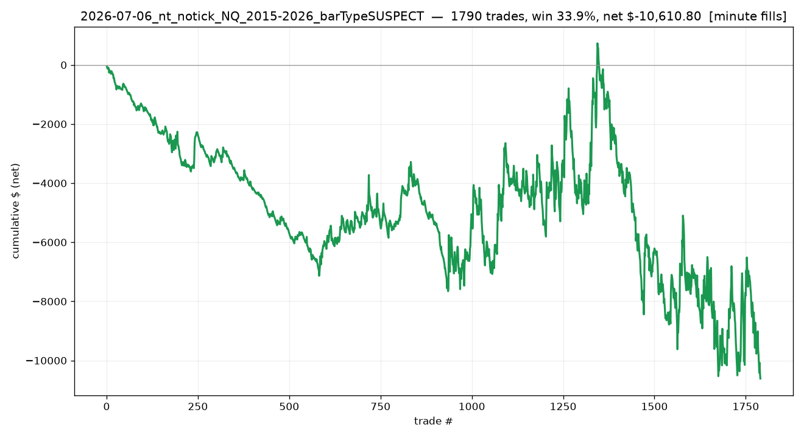

# 2026-07-06_nt_notick_NQ_2015-2026_barTypeSUSPECT

## Label
- **platform**: ninjatrader
- **bar_type**: SUSPECT (likely Tick/150, not Minute/1)
- **tick_replay**: False
- **fill_resolution**: minute
- **commission_per_rt**: 5.76
- **slippage_ticks**: 0
- **sample_type**: full
- **notes**: SUSPECT run. 1790 trades - ~5x too many, consistent with a Tick/150 primary series (wrong bar type) generating spurious signals. Tick Replay OFF. Kept only as a cautionary comparison; do NOT trust these numbers.

## Results
- **trades**: 1790  ({'long': 1093, 'short': 697})
- **actual range**: 2015-01-02 → 2026-03-19
- **win rate**: 33.9%   (target-hit on brackets: 32.5%)
- **expectancy**: n/a R   |   **total**: n/a R   |   maxDD n/a R
- **net $**: -10,610.80   (gross -300.40, commission -10,310.40)
- **profit factor**: 1.00   |   maxDD $-11,342.92
- **avg win / loss (pts)**: +12.76 / -6.54

## Exits
- Stop loss: 1122
- Profit target: 539
- Exit on session close: 85
- Sell: 35
- Buy to cover: 9
