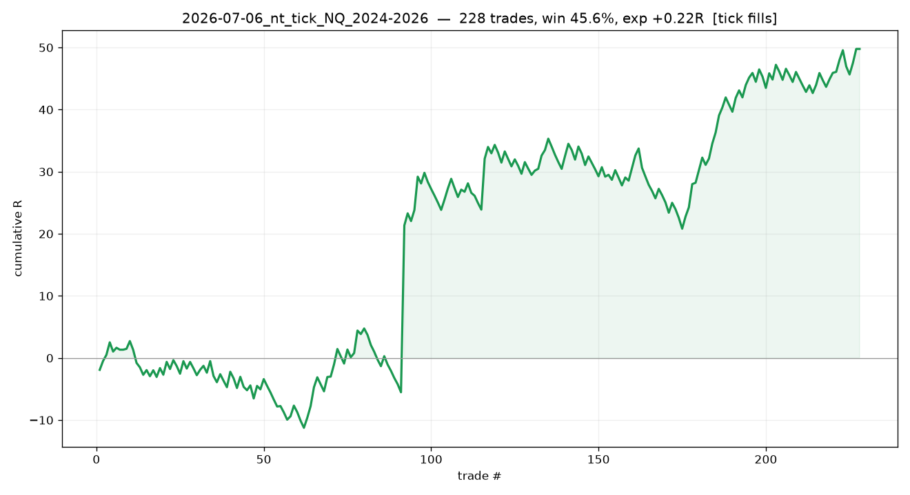

# 2026-07-06_nt_tick_NQ_2024-2026

## Label
- **platform**: ninjatrader
- **bar_type**: Minute/1
- **tick_replay**: True
- **fill_resolution**: tick
- **commission_per_rt**: 4
- **slippage_ticks**: 1
- **sample_type**: full
- **notes**: 

## Results
- **trades**: 228  ({'long': 139, 'short': 89})
- **actual range**: 2024-03-14 → 2026-03-19
- **win rate**: 45.6%   (target-hit on brackets: 44.2%)
- **expectancy**: +0.22 R   |   **total**: +49.78 R   |   maxDD -14.49 R
- **net $**: +22,141.00   (gross +23,053.00, commission -912.00)
- **profit factor**: 1.47   |   maxDD $-4,281.00
- **avg win / loss (pts)**: +34.85 / -19.94

## Exits
- Stop loss: 111
- Profit target: 88
- Sell: 18
- Buy to cover: 11
