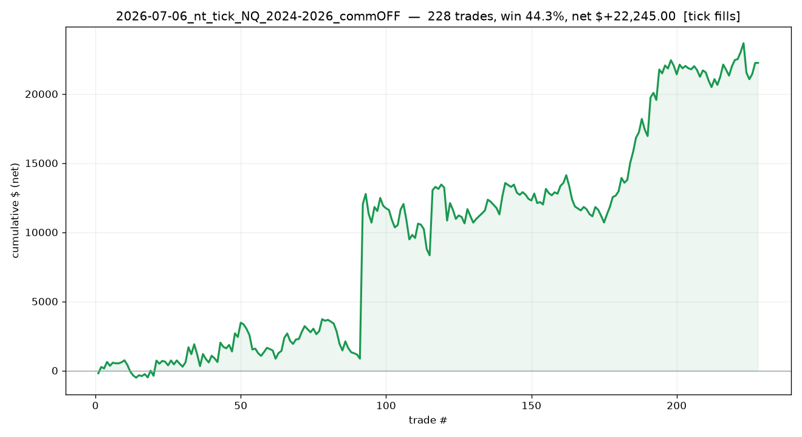

# 2026-07-06_nt_tick_NQ_2024-2026_commOFF

## Label
- **platform**: ninjatrader
- **bar_type**: Minute/1
- **tick_replay**: True
- **fill_resolution**: tick
- **commission_per_rt**: 0.0
- **slippage_ticks**: 0
- **sample_type**: out_of_sample
- **notes**: FIRST honest run (tick replay ON, Minute/1). Commission was OFF and slippage 0 - NOT yet aligned to the $4/RT + 1tick contract. Tick data only reaches ~2yr so trades start 2024-03 despite the 2020 request. No Stop/Target/R columns yet (R inferred/absent).

## Results
- **trades**: 228  ({'long': 139, 'short': 89})
- **actual range**: 2024-03-14 → 2026-03-19
- **win rate**: 44.3%   (target-hit on brackets: 42.7%)
- **expectancy**: n/a R   |   **total**: n/a R   |   maxDD n/a R
- **net $**: +22,245.00   (gross +22,245.00, commission -0.00)
- **profit factor**: 1.45   |   maxDD $-4,435.00
- **avg win / loss (pts)**: +35.75 / -19.68

## Exits
- Stop loss: 114
- Profit target: 85
- Sell: 18
- Buy to cover: 11
