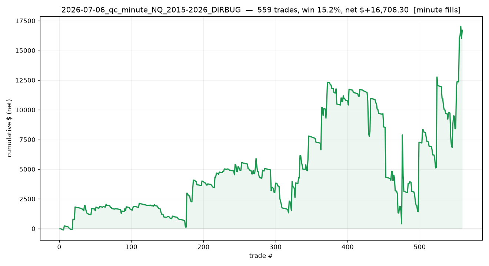

# 2026-07-06_qc_minute_NQ_2015-2026_DIRBUG

## Label
- **platform**: quantconnect
- **bar_type**: Minute/1
- **tick_replay**: False
- **fill_resolution**: minute
- **commission_per_rt**: 4.0
- **slippage_ticks**: 1
- **sample_type**: full
- **notes**: 555 short / 4 long — QC long-side entries broken (NT gets balanced on identical math). NOT a valid regime check until fixed.

## Results
- **trades**: 559  ({'short': 555, 'long': 4})
- **actual range**: 2015-01-02 → 2026-06-30
- **win rate**: 15.2%   (target-hit on brackets: n/a)
- **expectancy**: n/a R   |   **total**: n/a R   |   maxDD n/a R
- **net $**: +16,706.30   (gross +19,110.00, commission -2,403.70)
- **profit factor**: 1.31   |   maxDD $-11,912.90
- **avg win / loss (pts)**: +47.41 / -6.49

## Exits
