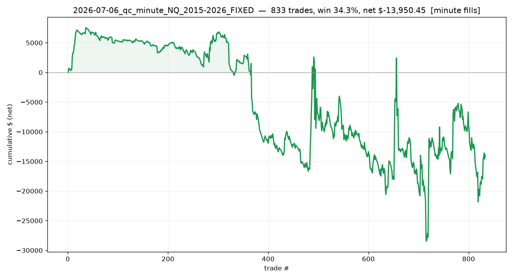

# 2026-07-06_qc_minute_NQ_2015-2026_FIXED

## Label
- **platform**: quantconnect
- **bar_type**: Minute/1
- **tick_replay**: False
- **fill_resolution**: minute
- **commission_per_rt**: 4.0
- **slippage_ticks**: 1
- **sample_type**: full
- **notes**: Raw-normalization + bracket-order fix. Longs fill (532L/299S). Minute fills (crude - likely pessimistic vs tick).

## Results
- **trades**: 833  ({'long': 525, 'short': 308})
- **actual range**: 2015-01-06 → 2026-06-30
- **win rate**: 34.3%   (target-hit on brackets: n/a)
- **expectancy**: n/a R   |   **total**: n/a R   |   maxDD n/a R
- **net $**: -13,950.45   (gross -10,375.00, commission -3,575.45)
- **profit factor**: 0.96   |   maxDD $-36,014.70
- **avg win / loss (pts)**: +43.17 / -23.52

## Exits
