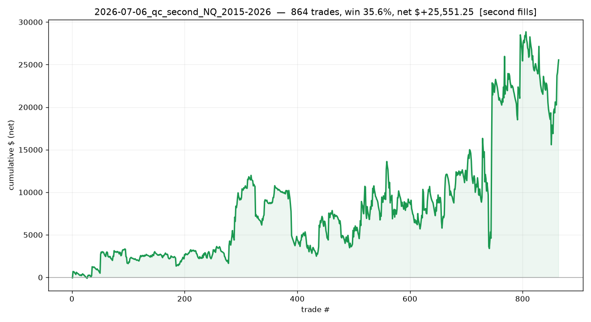

# 2026-07-06_qc_second_NQ_2015-2026

## Label
- **platform**: quantconnect
- **bar_type**: Minute/1
- **tick_replay**: False
- **fill_resolution**: second
- **commission_per_rt**: 4.0
- **slippage_ticks**: 1
- **sample_type**: full
- **notes**: HONEST 11yr: Second-resolution fills 2015-2026. All bugs fixed (bar-type, exit-seq, price-scale, resolution).

## Results
- **trades**: 864  ({'long': 550, 'short': 314})
- **actual range**: 2015-01-06 → 2026-06-30
- **win rate**: 35.6%   (target-hit on brackets: n/a)
- **expectancy**: n/a R   |   **total**: n/a R   |   maxDD n/a R
- **net $**: +25,551.25   (gross +29,260.00, commission -3,708.75)
- **profit factor**: 1.15   |   maxDD $-13,263.50
- **avg win / loss (pts)**: +35.61 / -17.10

## Exits
