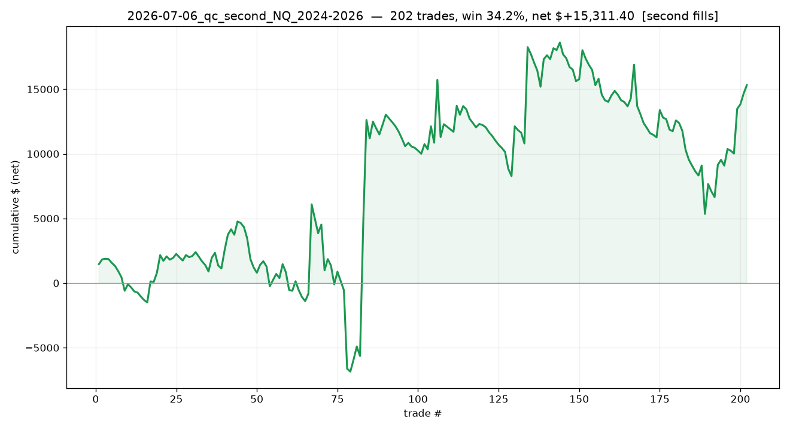

# 2026-07-06_qc_second_NQ_2024-2026

## Label
- **platform**: quantconnect
- **bar_type**: Minute/1
- **tick_replay**: False
- **fill_resolution**: second
- **commission_per_rt**: 4.0
- **slippage_ticks**: 1
- **sample_type**: out_of_sample
- **notes**: Second-resolution honest fills, 2024-2026 (validation vs NT tick)

## Results
- **trades**: 202  ({'long': 127, 'short': 75})
- **actual range**: 2024-01-18 → 2026-06-30
- **win rate**: 34.2%   (target-hit on brackets: n/a)
- **expectancy**: n/a R   |   **total**: n/a R   |   maxDD n/a R
- **net $**: +15,311.40   (gross +16,180.00, commission -868.60)
- **profit factor**: 1.19   |   maxDD $-13,263.50
- **avg win / loss (pts)**: +71.96 / -31.25

## Exits
